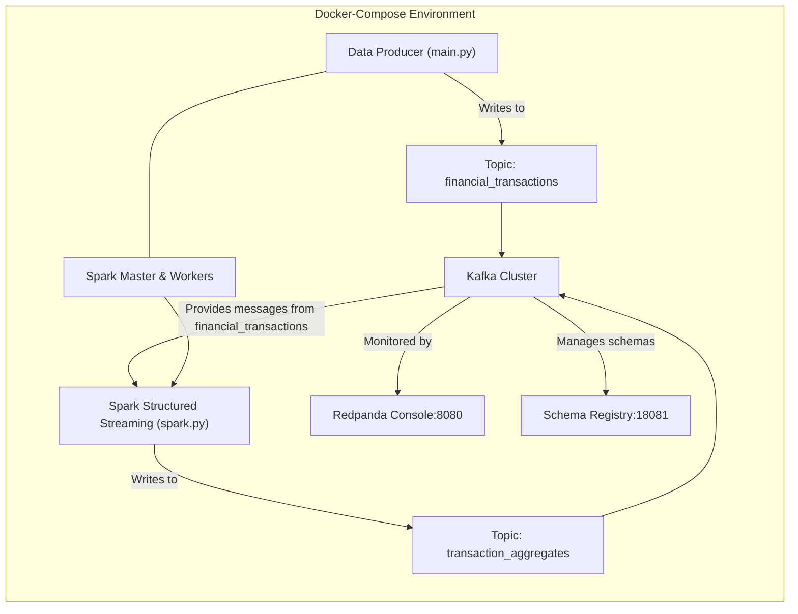

## Project Overview

This mini project showcases a **real-time data pipeline** that combines **Apache Kafka** and **Apache Spark (Structured Streaming)** within a containerized environment. 

### Key Capabilities

1. **Generates High-Volume Synthetic Data**  
   A custom data producer simulates high-frequency financial transactions and sends them to Kafka in real time.

2. **Handles Real-Time Ingestion and Buffering**  
   Kafka serves as a distributed messaging platform, ingesting and retaining these streaming events for downstream consumers.

3. **Processes and Aggregates Data in Real Time**  
   Spark Structured Streaming consumes the incoming Kafka data, computes live statistics (such as total transaction amounts per merchant), and publishes aggregated results back to Kafka.

4. **Operates in a Distributed, Scalable Environment**  
   Docker Compose orchestrates a multi-broker Kafka cluster, multi-node Spark cluster, and supporting services (Schema Registry, monitoring console), allowing each component to scale or be replaced independently.

---

## Architecture Diagram

## Run the Project

1. **Start the services**
   
     docker compose up -v

2. **Access the Redpanda Console**
   
     Open http://localhost:8080 in your browser.
     Use this console to view and manage Kafka topics, consumer groups, and more.

3. **Access the Spark UI**
   
      Visit http://localhost:9190 to monitor Spark jobs, worker status, and resource usage.
